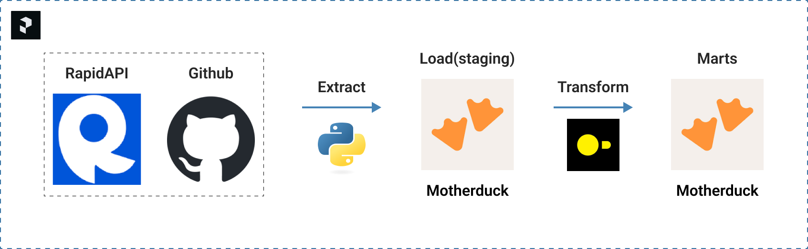
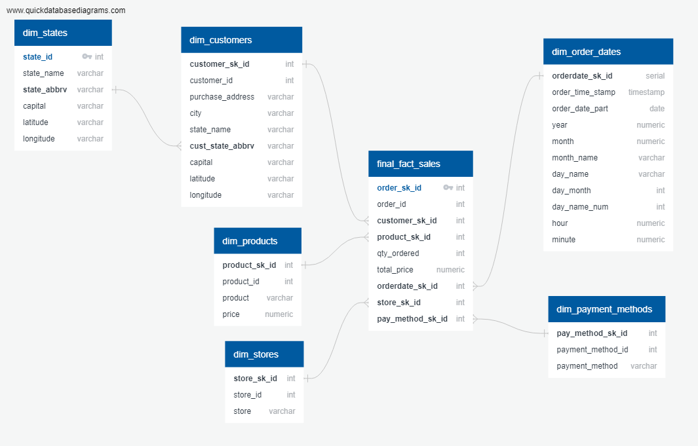

# ELT Data pipeline using Prefect, Python, Motherduck, DuckDB

## About the Project
This project will extract and load sales data into motherduck and will then be transformed using duckdb SQL.

## Directories
`csv_files` - contains the __states.csv__ file with states data extracted from rapidAPI

`dbt_md_product_sales` - contains dbt files.
> This project currently uses duckdbSQL to transform the data. Dbt adapter for motherduck has some connection issues.

`eda` - contains eda_sales.ipynb which is used for data cleaning and transformation locally.

`img` - contains image files

`prefect-flows` - contains all python scripts used for extraction and orchestration.

## Project Diagram

Process:
1. Extract US states data from RapidAPI
2. Extract raw sales csv from github
3. Load raw states and sales data to staging table in motherduck
4. Transform raw data using duckdb SQL
> **Note**: data type for latitude and longitude for dim_states table will currently be in `varchar` since using the decimal type rounds off the decimal values.

## Data model diagram

