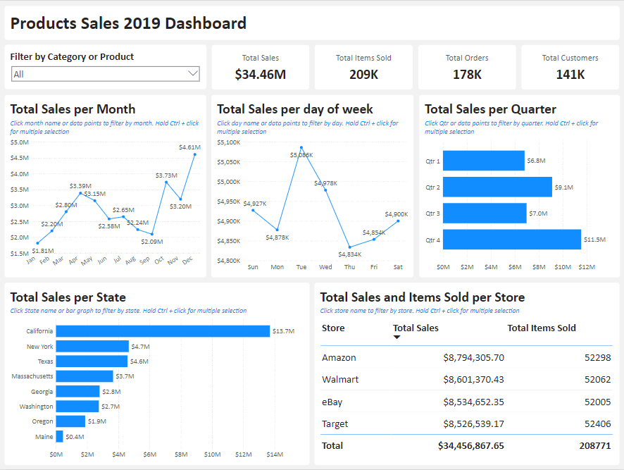
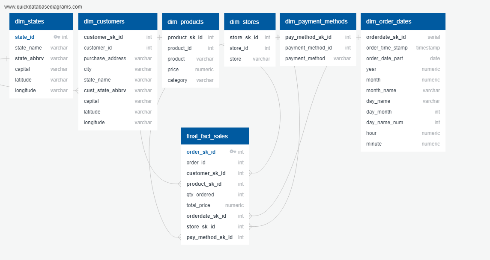

# ELT Data pipeline using Prefect, Python, Motherduck, DuckDB

## About the Project
This project will extract and load sales data into motherduck and will then be transformed using duckdb SQL.

## Directories

| Directory | Description |
| --- | --- |
|`csv_files` | contains *states.csv* |
|`data_exploration`| contains *data_exploration.ipynb*|
|`data_viz`| contains powerbi files|
|`img`| image assets|
|`prefect-flows`|python files for orchestration|

## Project Diagram

Process:
1. Extract US states data from RapidAPI
2. Extract raw sales csv from github
3. Load raw states and sales data to staging table in motherduck
4. Transform raw data using duckdb SQL
> **Note**: data type for latitude and longitude for dim_states table will currently be in `varchar` since using the decimal type rounds off the decimal values.

## PowerBI Dashboard Screenshot

File download [link](https://github.com/krtmlry/md_product_sales/blob/main/data_viz/powerbi/product_sales_dashboard.pbix)

## Data model diagram

